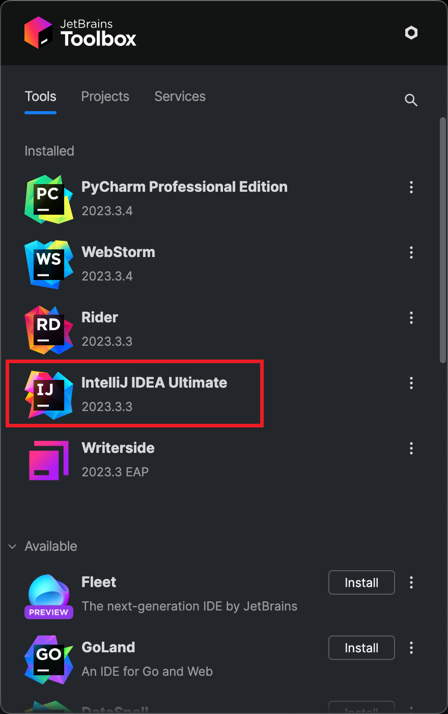

# 1. Development Environment Installation

用Mac的同學有福了，唔使再痛苦咁搞Tomcat、OpenJDK。用 [Homebrew](Homebrew.md) 啦! \
用Docker的同學有福了，唔使再痛苦咁搞MariaDB、MySQL Workbench。裝 [Docker](Docker.md) 啦!

## Integrated Development Environment (IDE)

For developing J2EE applications, I recommend using the IntelliJ IDEA Ultimate Edition. It offers comprehensive support
for Java EE, Spring, and other enterprise technologies.

1. Install JetBrains Toolbox using Homebrew
    ```bash
    brew install jetbrains-toolbox
    ```

2. Install IntelliJ IDEA Ultimate Edition using JetBrains Toolbox
   { width="400" }

## Java Development Kit (JDK)

- Install the latest OpenJDK using Homebrew
   ```bash
   brew install openjdk
   ```
- For the system Java wrappers to find this JDK, symlink it with
  ```bash
  sudo ln -sfn /opt/homebrew/opt/openjdk/libexec/openjdk.jdk /Library/Java/JavaVirtualMachines/openjdk.jdk
  ```

- If you need to have openjdk first in your PATH, run (Optional)
    ```bash
    echo 'export PATH="/opt/homebrew/opt/openjdk/bin:$PATH"' >> ~/.zshrc
    ```

- For compilers to find openjdk you may need to set (Optional)
    ```bash
    export CPPFLAGS="-I/opt/homebrew/opt/openjdk/include"
    ```
- The JDK path you need to add to IntelliJ IDEA is
    ```bash
    /Library/Java/JavaVirtualMachines/openjdk.jdk/Contents/Home
    ```

## Java Servlet Container

### Apache Tomcat

Install Apache Tomcat, TomEE Plume or TomEE Plus using Homebrew

```bash
brew install tomcat

# To start tomcat now and restart at login:
brew services start tomcat

# Or, if you don't want/need a background service you can just run:
/opt/homebrew/opt/tomcat/bin/catalina run

# Configuration files: 
/opt/homebrew/etc/tomcat
```

### Apache TomEE

兩個版本二選一，Version comparison:
[https://tomee.apache.org/comparison.html](https://tomee.apache.org/comparison.html)

```bash
brew install tomee-plume

# OR

brew install tomee-plus
```

以下內容純屬參考

```Bash
# The home of Apache TomEE Plume is:
/opt/homebrew/opt/tomee-plume/libexec

# To run TomEE manually if you need to:
/opt/homebrew/opt/tomee-plume/bin/startup.sh

# The home of Apache TomEE Plus is:
/opt/homebrew/opt/tomee-plus/libexec

# To run TomEE manually if you need to:
/opt/homebrew/opt/tomee-plus/libexec/bin/startup.sh
```

## Database Management System

@use [Docker](Docker.md) \
Install MariaDB & PhpMyAdmin using Andrew Fung's Docker
Templates: [Tomcat-MariaDB-phpMyAdmin All-in-One Docker Template](https://github.com/andrewfung729/tomcat-mariadb-phpmyadmin-aio-docker)

> ❗❗❗ Don't forget to follow the instructions in the README file!

### 簡單教學

1. 開新Project，將docker-compose.yml放入Project根目錄
2. 如不需要Tomcat部份，刪除整個`tomcat` service
3. 然後在Terminal執行
    ```bash
    docker-compose up
    ```

## References

- [https://www.jetbrains.com/help/idea/deploying-a-web-app-into-an-app-server-container.html](https://www.jetbrains.com/help/idea/deploying-a-web-app-into-an-app-server-container.html)